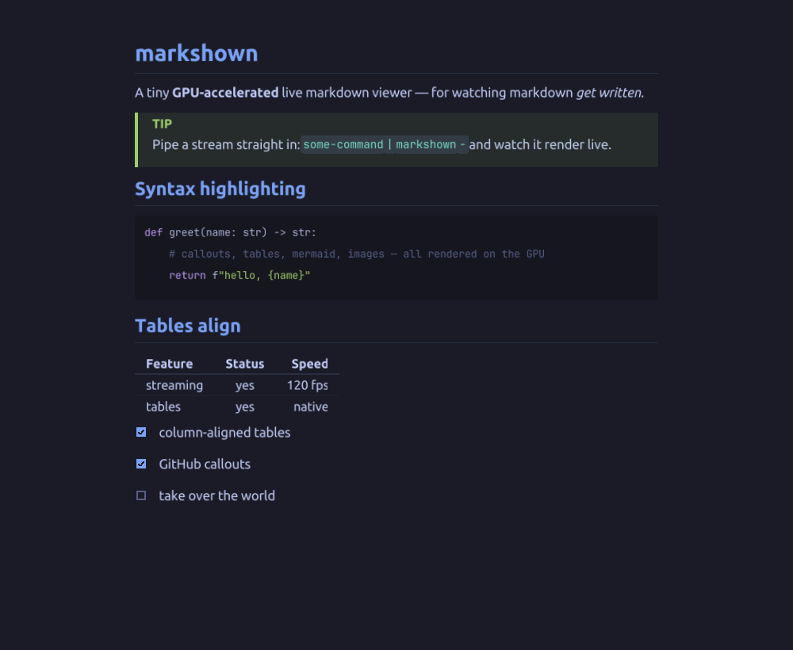

<div align="center">

# markshown

**A tiny GPU-accelerated live markdown viewer, for watching markdown _get written_.**



</div>

`markshown` renders markdown on the GPU ([raylib](https://www.raylib.com/) + [md4c](https://github.com/mity/md4c))
and hot-reloads the instant a file changes, or reads a **live stream** from stdin. It's built for *watching
something get written*: an LLM, an agent, a build log. Half-written markdown still renders, the newest change
is always framed in view, and freshly written blocks flash green.

It's one file: `markshown.c`, ~1300 lines.

## Quick start

```sh
# view a file (hot-reloads on every save)
nix run github:0xPD33/markshown -- notes.md

# or pipe a live stream straight in and watch it render as it's written
some-command | nix run github:0xPD33/markshown -- -
```

Without Nix (needs `raylib` and `md4c` on your system):

```sh
cc -O2 -o markshown markshown.c -lraylib -lmd4c -lm
./markshown notes.md
```

## Streaming is the point

The thing markshown does that a normal viewer doesn't: render markdown **as it streams in**, byte by byte.

```sh
# watch an LLM write a tutorial
llm "write a markdown guide to grep" | markshown -

# follow a build / log
make 2>&1 | markshown -

# tail a file an agent is appending to
tail -f agent-notes.md | markshown -
```

Mid-stream the document is *broken* markdown: an unterminated ` ``` ` fence, a half-typed table row. markshown
sanitizes the tail so it still renders as prose, marks the live code block with a blinking caret, keeps the
newest line in view, and flashes each freshly written block. When the stream ends (EOF) the final document
freezes in place.

`markshown -` reads stdin explicitly; piping into bare `markshown` (no tty on stdin) does the same. File +
inotify mode is always intact.

## Features

**Live**
- inotify hot-reload (survives atomic rename-writes)
- stdin streaming with stream-robust partial rendering
- **change-glow**: per-block diff on reload/stream; changed blocks flash a fading green bar + wash
- **jump-to-change**: smooth-scrolls to the most recently edited/appended block (pauses when you scroll)

**Render**
- headings, **bold** / *italic* / ~~strike~~ / `inline code` / links (+ autolinks)
- nested, ordered, and task lists (checkboxes write back to the file)
- **column-aligned GFM tables** (honors `:--` / `:-:` / `--:` alignment)
- **GitHub callouts**: `> [!NOTE]` `> [!TIP]` `> [!IMPORTANT]` `> [!WARNING]` `> [!CAUTION]`
- **mermaid diagrams**: ` ```mermaid ` rendered via `mmdc` (background, cached), falls back to code if absent
- images: **local, remote (`http(s)` via `curl`), and inline**, plus syntax-highlighted fenced code
- nested blockquotes, raw HTML (block verbatim + inline `<br>`), hard line breaks, numeric/named HTML entities
- tokyonight theme; fonts resolved at runtime via `fc-match`

**Interact**
- scroll (wheel / keys), zoom (`+`/`-` or ctrl+wheel), incremental **search** (`/`, `n`/`N`)
- text selection (drag / double-click) + copy, per-code-block copy button
- clickable links (with URL tooltip) and task checkboxes
- **outline sidebar** (`o` / `Tab`) with click-to-jump + a change-minimap strip

## Keybindings

| Key | Action |
|:----|:-------|
| `j` / `k`, `↓` / `↑`, wheel | scroll |
| `PgDn` / `PgUp`, `g` / `G`, `Home` / `End` | page / jump / follow |
| `+` / `-`, ctrl+wheel | zoom |
| `/`, then `n` / `N` | search, next / previous match |
| `o` / `Tab` | toggle outline sidebar |
| `Ctrl+C` | copy selection |
| `q` | quit |

Mouse: drag or double-click to select, click links, checkboxes, and outline entries, hover a code block for
its copy button.

## Optional external tools

These are resolved from `PATH` at runtime; markshown degrades gracefully without them.

- **`mmdc`** ([mermaid-cli](https://github.com/mermaid-js/mermaid-cli)): renders ` ```mermaid ``` ` blocks to
  images. Without it, mermaid blocks render as highlighted code. (Wired into the Nix flake.)
- **`curl`**: fetches `http(s)` images. Without it, remote images show a placeholder.

## Build

```sh
nix build       # -> ./result/bin/markshown (wraps fc-match + mmdc onto PATH)
nix run         # build and run
nix develop     # dev shell with raylib, md4c, fontconfig, mermaid-cli
```

The flake pins **raylib 6.0**. Building against an older raylib locally is fine, but sanity-check rendering
against the flake toolchain. `MSAA_4X_HINT` is deliberately not used, as its resolve mis-blits under HiDPI
Wayland on raylib 6.0.

## How it works

A single file. md4c parses markdown into a flat list of blocks; a small render loop flows runs across mixed
fonts, lays out tables, and draws everything with raylib each frame. A pre-parse pass keeps half-streamed
markdown sane. Images and mermaid diagrams are rendered/fetched in background processes and swapped in when
ready, so the 120 fps loop never blocks.
