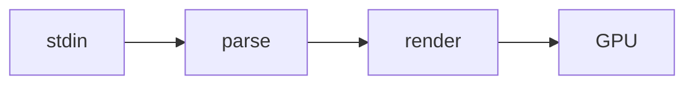

# markshown

A tiny GPU-accelerated live markdown viewer. This file exists to exercise the renderer.

## Inline styling

Here is **bold**, *italic*, ***bold italic***, ~~strikethrough~~, and some `inline code`.
A [link to nixos](https://nixos.org) should be underlined and colored.

Entities decode too: AT&T, 5 < 6, 6 > 5, "quoted" and non breaking&nbsp;space.

## Lists

- first bullet
- second bullet
  - nested bullet
  - another nested
- third bullet

1. ordered one
2. ordered two
3. ordered three

### Task list

- [x] write the renderer
- [x] rename to markshown
- [ ] ship it

## Code block

```c
// greet the world, then bail
int main(void) {
    const char *who = "markshown";
    printf("hello, %s\n", who);   /* classic */
    return 0;
}
```

## Image


A missing one falls back to a placeholder:


## Blockquote

> The best code is the code never written.
> — every tired senior dev

## Callouts

> [!NOTE]
> Callouts are GitHub-style admonitions: a colored bar, a faint wash, and a label.

> [!TIP]
> Pipe a stream in with `cmd | markshown -` to watch markdown get written live.

> [!WARNING]
> An unterminated code fence mid-stream is closed synthetically so the tail still renders.

## Mermaid



## Table

| feature   | status |
|-----------|--------|
| headings  | done   |
| tables    | done   |
| hot reload| done   |

---

That horizontal rule above marks the end. Scroll with `j`/`k`, zoom with `+`/`-`, quit with `q`.
